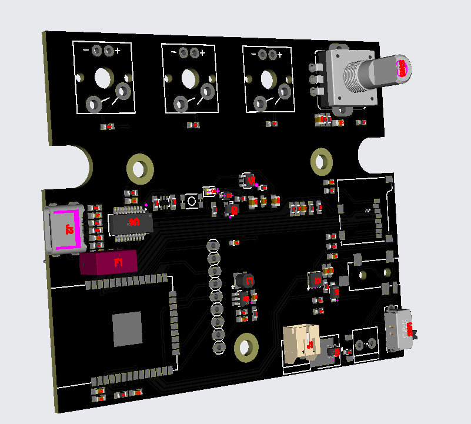
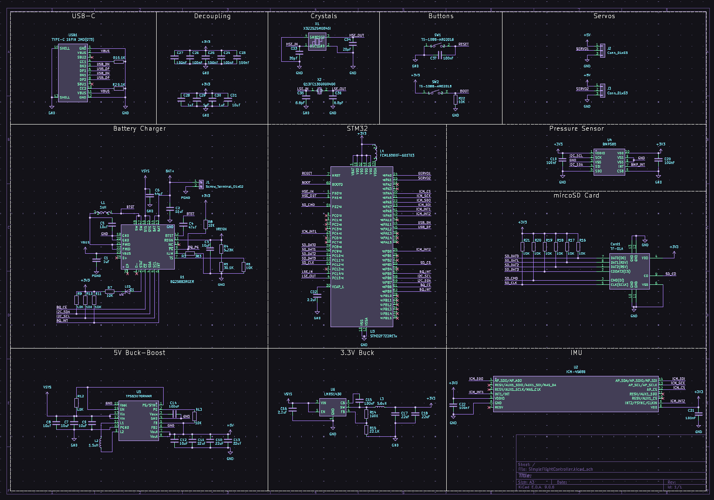
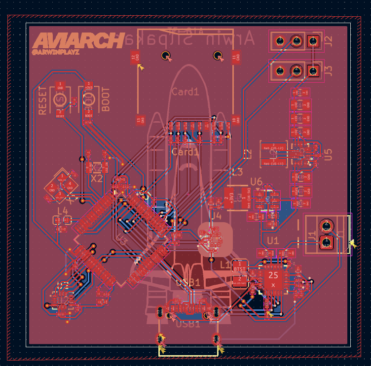

# Music Player

## After going camping without reception, I though of creating a mp3 music player which runs off a microSD card. It has WiFi and bluetooth compatibility too!

## Project Overview

The goal was to create a way to listen to music without any reception.

---

## Screenshots

### 1. Overall

### 2. Schematic

### 3. PCB layout

### 4. Design

### 5. BOM

